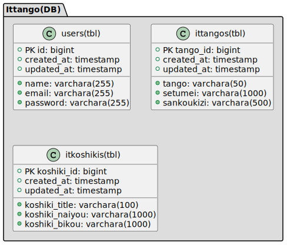

## 概要

## テーブル説明

### users

| No. | 名称       |      型       | 規定値 | 内容                             |
| --: | :--------- | :-----------: | :----: | -------------------------------- |
|   1 | user_id         |    bigint     |        | ユーザーの ID を設定する。       |
|   2 | name       | varchara(255) |        | ユーザーの名前を設定する。       |
|   3 | email      | varchara(255) |        | ユーザーの Email を設定する。    |
|   4 | password   | varchara(255) |        | ユーザーのパスワードを設定する。 |
|   5 | created_at |   timestamp   |        | 作成日を設定する。               |
|   6 | updated_at |   timestamp   |        | 更新日を設定する。               |

### ittangos

| No. | 名称       |      型       | 規定値 | 内容                        |
| --: | :--------- | :-----------: | :----: | --------------------------- |
|   1 | tango_id         |    bigint     |        | 単語の ID を設定する。      |
|   2 | tango      | varchara(255) |        | 単語を設定する。            |
|   3 | setumei    | varchara(255) |        | 単語の説明を設定する。      |
|   4 | sankoukizi | varchara(255) |        | 参考記事の URL を設定する。 |
|   5 | created_at |   timestamp   |        | 作成日を設定する。          |
|   6 | updated_at |   timestamp   |        | 更新日を設定する。          |

### itkoshikis

| No. | 名称       |      型       | 規定値 | 内容                        |
| --: | :--------- | :-----------: | :----: | --------------------------- |
|   1 | koshiki_id         |    bigint     |        | 公式の ID を設定する。      |
|   2 | koshiki_title      | varchara(255) |        | 公式を設定する。            |
|   3 | koshiki_naiyo| varchara(255) |        | 公式の内容を設定する。      |
|   4 | koshiki_biko | varchara(255) |        | 公式の備考を設定する。 |
|   5 | created_at |   timestamp   |        | 作成日を設定する。          |
|   6 | updated_at |   timestamp   |        | 更新日を設定する。          |
